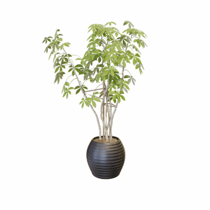
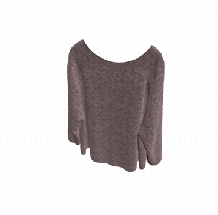
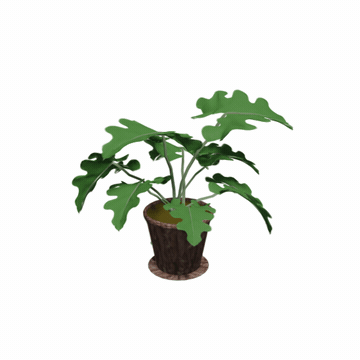
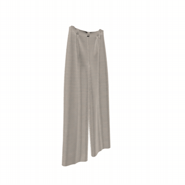
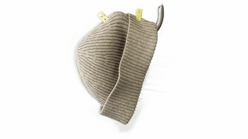
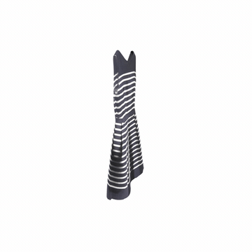

# [ICLR 2026] DiffWind: Physics-Informed Differentiable Modeling of Wind-Driven Object Dynamics

### [Project Page](https://zju3dv.github.io/DiffWind/) · [OpenReview](https://openreview.net/forum?id=vKVzihkbQo) · [arXiv](https://arxiv.org/abs/2603.09668)

> **DiffWind: Physics-Informed Differentiable Modeling of Wind-Driven Object Dynamics**
> Yuanhang Lei\*, Boming Zhao\*, Zesong Yang\*, Xingxuan Li, Tao Cheng,
> Haocheng Peng, Ru Zhang, Yang Yang, Siyuan Huang, Yujun Shen, Ruizhen Hu,
> Hujun Bao, Zhaopeng Cui†


## Method overview


DiffWind represents wind as a grid-based physical field and objects as particle
systems derived from 3D Gaussian Splatting. Their interaction is modeled by MPM,
while an LBM solver supplies a fluid-dynamics constraint and wind force. The
differentiable simulator and renderer enable gradients from image-space losses
to the object state and force field.

## What is released

- Coupled 3D LBM–MPM forward simulation with configurable wind conditions.
- Differentiable MPM transfer, constitutive, integration, and force-field code.
- Differentiable Gaussian rendering, including the CUDA backward implementation.
- Deterministic multiview rendering for Ficus, Sweater, Potted Plant, Pants,
  Alocasia, Hat, Dress, and Flag.
- Physics configurations and the required surface/filling PLY assets.

The backward implementation is available in
[`simulator/mpm_simulator_force.py`](simulator/mpm_simulator_force.py),
[`simulator/estimator_force.py`](simulator/estimator_force.py), and
[`third_party/diff-gaussian-rasterization/cuda_rasterizer/backward.cu`](third_party/diff-gaussian-rasterization/cuda_rasterizer/backward.cu).

## Forward simulation results

The following animations show the first released camera view (`train_view0`)
for each object. Click an animation to open the corresponding MP4 file.

| Ficus | Sweater |
| --- | --- |
| [](media/results/ficus_view0.mp4) | [](media/results/sweater_view0.mp4) |

| Potted Plant | Pants |
| --- | --- |
| [](media/results/potted_plant_view0.mp4) | [](media/results/pants_view0.mp4) |

| Alocasia | Hat |
| --- | --- |
| [](media/results/alocasia_view0.mp4) | [](media/results/hat_view0.mp4) |

| Dress | Flag |
| --- | --- |
| [](media/results/dress_view0.mp4) | [](media/results/flag_view0.mp4) |

## Installation

The code was validated with Python 3.7, PyTorch 1.13.1, CUDA 11.7, and Taichi
1.5.0. To create the environment:

```bash
conda env create -f environment.yml
conda activate diffwind
```

Build the included differentiable rasterizer with an available CUDA toolkit:

```bash
python -m pip install ./third_party/diff-gaussian-rasterization
```

`ffmpeg` is optional and is only used to encode rendered PNG sequences as MP4.

## Quick start

Run a coupled forward simulation:

```bash
./scripts/run_ficus_forward.sh 0
./scripts/run_sweater_forward.sh 0
./scripts/run_potted_plant_forward.sh 0
./scripts/run_pants_forward.sh 0
./scripts/run_alocasia_forward.sh 0
./scripts/run_hat_forward.sh 0
./scripts/run_dress_forward.sh 0
./scripts/run_flag_forward.sh 0
```

A short validation run is:

```bash
./scripts/run_sweater_forward.sh 0 --frames 2 --mpm_iter_cnt 1 --warmup_steps 2 --lbm_steps 1 --no_video
```

Useful options include:

- `--frames N`: number of output frames (default: 100).
- `--wind_frames N`: stop applying coupled LBM wind at frame `N` (default: 50,
  matching the final demo scripts).
- `--mpm_iter_cnt N`: override the per-frame MPM substeps from the scene config;
  this is useful for a lightweight smoke test.
- `--save_state`: save per-frame MPM particle states.
- `--save_fields`: save 128³ wind-force and occupancy fields. These consume
  substantial disk space and are disabled by default.
- `--no_video`: keep PNG frames without invoking `ffmpeg`.
- `OUTPUT_DIR=/path`: override the wrapper's default output directory.

Outputs are written under `outputs/<scene>/render_wind_couple/` or
`outputs/<scene>_multiview/multiview/`.

## Repository layout

```text
assets/                         Released Gaussian and filling PLY files
configs/                        Per-scene material and simulation settings
gaussian_renderer/              Differentiable Gaussian rendering interface
scene/                          Gaussian model and orbit cameras
simulator/                      Differentiable MPM and estimator/backward code
third_party/diff-gaussian-.../  CUDA rasterizer with forward/backward kernels
HOME_LBM.py                     3D LBM fluid solver
simulate.py                     Coupled forward simulation entry point
render_multiview.py             Static multiview rendering entry point
scripts/                        Portable scene wrappers
```

See [`assets/README.md`](assets/README.md) for the released point counts.

## Acknowledgement

This codebase used lots of source code from:

1. [MPM](https://github.com/xuan-li/PAC-NeRF/blob/main/lib/engine/mpm_simulator.py)
2. [LBM](https://github.com/leqiqin/Computational-Biomimetics-of-Winged-Seeds/blob/main/LBM.py)
3. [3DGS](https://github.com/graphdeco-inria/gaussian-splatting)

We thank the authors of these projects.

## Citation

```bibtex
@inproceedings{lei2026diffwind,
  title     = {DiffWind: Physics-Informed Differentiable Modeling of Wind-Driven Object Dynamics},
  author    = {Lei, Yuanhang and Zhao, Boming and Yang, Zesong and Li, Xingxuan and Cheng, Tao and Peng, Haocheng and Zhang, Ru and Yang, Yang and Huang, Siyuan and Shen, Yujun and Hu, Ruizhen and Bao, Hujun and Cui, Zhaopeng},
  booktitle = {Proceedings of the Fourteenth International Conference on Learning Representations},
  year      = {2026},
  url       = {https://openreview.net/forum?id=vKVzihkbQo}
}
```
